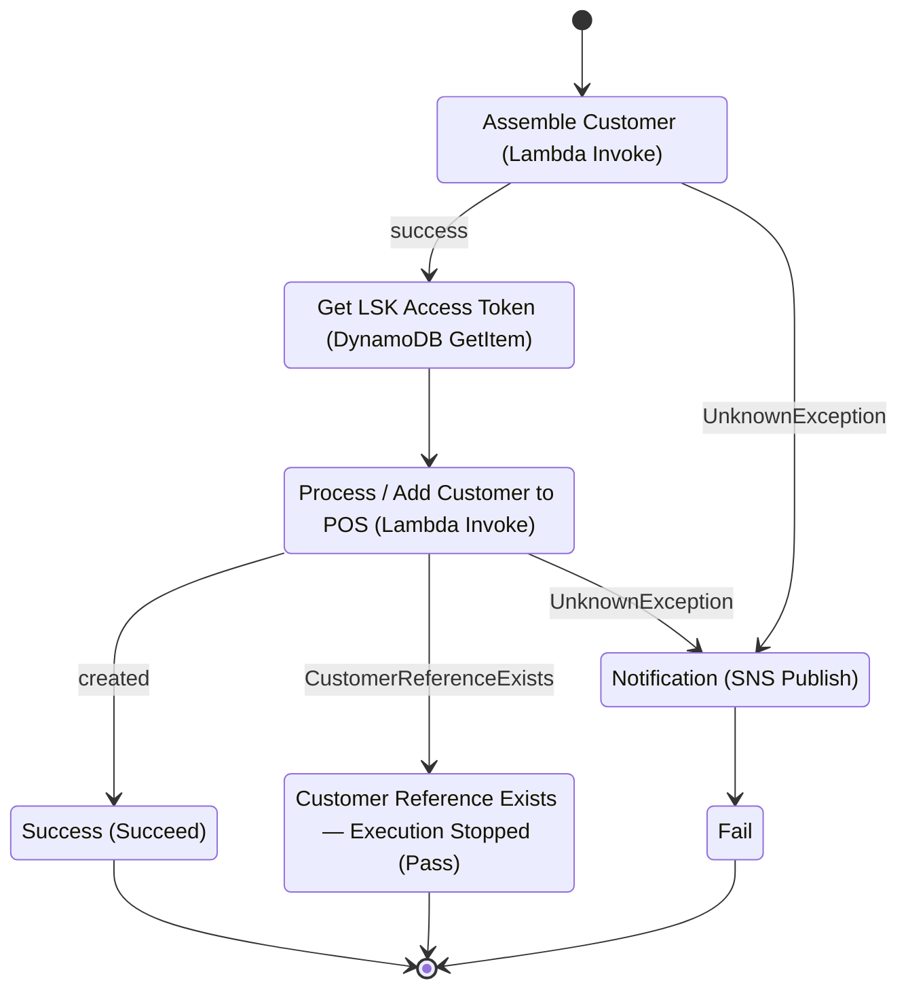

# Lightspeed K-Series — Create Customer in POS Workflow

> This is **workflow 3 of 3** in the Lightspeed K-Series integration. See the
> [project README](./README.md) for the big picture. It consumes the access token that the
> [Authorization Code Workflow](./AuthorizationCodeWorkflow.md) obtained and the
> [Access Token Refresh Workflow](./TokenRefreshWorkflow.md) keeps valid.

This document describes the workflow ConcieraHQ uses to create a customer record in the
**Lightspeed K-Series** POS using a valid OAuth2 access token. It is provided to support the
application review process for production OAuth2 credentials and demonstrates how ConcieraHQ
*consumes* its stored access token to write data into Lightspeed on a tenant's behalf.

> Region identifiers, AWS account identifiers, and individual tenant identifiers have been
> redacted from this document. Resource ARNs are shown with placeholders (`<aws-region>`,
> `<aws-account-id>`, `<tenantId>`) where required for context.

This workflow is the consumption counterpart to the
[Access Token Refresh Workflow](./TokenRefreshWorkflow.md): that process keeps the stored access
token valid; this process reads that token and uses it to call the Lightspeed API.

---

## Overview

When a customer needs to be synced into a venue's Lightspeed K-Series POS, ConcieraHQ runs an
**AWS Step Functions** state machine that:

1. Normalises the incoming customer data into a standardised schema,
2. Reads the **current** Lightspeed access token from secure storage, and
3. Creates the customer in the POS via the Lightspeed K-Series API.

The access token is never held by the tenant or passed in from the caller — it is retrieved
server-side, at execution time, from the same OAuth registry that the refresh workflow keeps
current. The workflow is idempotent: if the customer already exists in the POS, it stops
gracefully rather than creating a duplicate or failing.

---

## Workflow



### Steps

**1. Assemble Customer** — `Lambda:Invoke`
`chq-prod-lambda-global-assemble-customercs-addPosLSK` cleans and normalises the incoming
customer data into a standardised schema. Source-specific records (e.g. Commerce7, Shopify,
WooCommerce) are reconciled here so that everything downstream works against one consistent
shape. An `UnknownException` routes to the notification/failure path.

**2. Get LSK Access Token** — `DynamoDB:GetItem`
The current access token is read from the application OAuth registry
(`chq-prod-ddb-global-store-application-oauth-registory`) using the application key
`AppID = lskpos`. A result selector extracts only the `AccessToken` value and places it on the
execution state under `$.authorisation`; no other stored fields are carried forward. Because
the refresh workflow keeps this record current, the token read here is always the
currently-valid one.

**3. Process / Add Customer to POS** — `Lambda:Invoke`
`chq-prod-lambda-global-process-pos-addCustomer` builds the Lightspeed payload from the
normalised customer and POSTs it to the K-Series API using the access token as a bearer
credential (see [POS API call](#pos-api-call-process-function-internals) below). Outcomes:

- **Created** → `Success`.
- **`CustomerReferenceExists`** → `CustomerRefererenceExists - Execution Stopped`, a terminal
  `Pass` state. The customer already exists in the POS, so the run ends cleanly — this is a
  successful, idempotent no-op, **not** a failure.
- **`UnknownException`** → notification/failure path.

**4. Success** — terminal `Succeed` state.

### Failure path

**Notification** — `SNS:Publish`
On an `UnknownException` from either Lambda, a message is published to the
`ConcieraHQ-Notifications` topic identifying the tenant and workflow
(`<tenantId>_SF_sync_customerCs_addPosLsk`), then the execution transitions to a terminal
`Fail` state.

---

## POS API call (process function internals)

The `chq-prod-lambda-global-process-pos-addCustomer` function calls the Lightspeed K-Series
Local Order API to create the customer record.

### Endpoint and authentication

```
POST https://api.lsk.lightspeed.app/o/op/1/order/local
Authorization: Bearer {access_token}
Content-Type: application/json

{ ...standardised customer payload... }
```

- **Bearer authentication** — the access token retrieved in step 2 is presented as a
  `Bearer` token. The token is sourced from secure storage at call time and is never supplied
  by, or exposed to, the tenant or the caller.
- **JSON body** — the request payload is built from the normalised customer record by a
  dedicated `Customer` payload builder, keeping POS-schema construction separate from
  transport concerns.

### Retry and backoff

- **Rate limiting (`429`):** retried up to 3 times with linear backoff (5s, 10s, 15s between
  attempts). If the limit is still exceeded after retries, the call fails.
- **Duplicate (`409`):** raised as `CustomerReferenceExists`, carrying the API's message. This
  is what drives the state machine's graceful idempotent stop rather than a failure.
- **Other `4xx` / `5xx`:** raised as an error and surfaced to the Lambda handler, which the
  state machine treats as an `UnknownException`.

### Separation of concerns

Data normalisation happens upstream (step 1) and POS-payload construction happens in the
process function, so the HTTP client itself only deals with authentication, request framing,
and retry behaviour. This keeps source-system quirks out of the API layer.

---

## Token usage and the wider lifecycle

| Stage | Responsible workflow |
|---|---|
| Initial authorisation (Authorization Code grant) | [Authorization Code Workflow](./AuthorizationCodeWorkflow.md) |
| Keeping the access token valid | [Access Token Refresh Workflow](./TokenRefreshWorkflow.md) |
| **Using the access token to write to the POS** | **This workflow** |

This workflow only ever *reads* the access token; it never refreshes, mints, or stores tokens.
That separation means token management is centralised in one place, and every consumer
(including this one) simply reads the latest valid token from the registry at execution time.

---

## Idempotency and error handling

- **Idempotent creates** — a `409` from Lightspeed is treated as "already exists" and ends the
  run successfully via a dedicated terminal state, preventing duplicate customer records on
  retried or replayed events.
- **Rate-limit resilience** — the POS call backs off and retries on `429` before giving up.
- **Lambda-level retries** — both Lambda invoke steps retry on transient Lambda service
  exceptions (`Lambda.ServiceException`, `Lambda.AWSLambdaException`,
  `Lambda.SdkClientException`, `Lambda.TooManyRequestsException`) with `MaxAttempts: 3`,
  `IntervalSeconds: 1`, `BackoffRate: 2`, and `FULL` jitter.
- **Operator alerting** — genuine failures publish to SNS with the tenant and workflow
  identifier, then mark the execution failed for observability.

---

## Security considerations relevant to verification

- **Token isolation** — the access token is read server-side from secure storage within the
  venue's own AWS account at execution time; it is never held by, passed from, or exposed
  to the tenant's users.
- **Per-tenant account isolation** — this workflow runs in the venue's **own AWS account**, one per
  venue. Customer data is assembled and pushed to that venue's POS entirely within its own account;
  it is never centralised into the shared Lightspeed service account or shared across tenants.
- **Bearer over HTTPS** — the token is sent only in the `Authorization` header to the
  Lightspeed API over HTTPS, never in a URL or query string.
- **Least-data execution** — the registry read returns only the access token; no other stored
  credential material enters the execution payload.
- **No duplicate side effects** — idempotent handling of `409` avoids creating duplicate
  records on replays.
- **Diagnostics isolation** — failure detail is routed to CloudWatch and operator
  notifications; end-user surfaces show only generic status.

---

## Resource reference (redacted)

| Logical resource | Type | Identifier |
|---|---|---|
| State machine | Step Functions | `chq-prod-sf-global-sync-customerCS-addPosLSK` |
| Assemble function | Lambda | `arn:aws:lambda:<aws-region>:<aws-account-id>:function:chq-prod-lambda-global-assemble-customercs-addPosLSK` |
| Process / add-customer function | Lambda | `arn:aws:lambda:<aws-region>:<aws-account-id>:function:chq-prod-lambda-global-process-pos-addCustomer` |
| OAuth registry | DynamoDB | `chq-prod-ddb-global-store-application-oauth-registory` |
| Notifications topic | SNS | `arn:aws:sns:<aws-region>:<aws-account-id>:ConcieraHQ-Notifications` |
| Lightspeed K-Series API | External | `https://api.lsk.lightspeed.app/o/op/1/order/local` |

---

*ConcieraHQ is developed by Konnectit.io. For technical queries relating to this integration,
contact dev@konnectit.io.*
