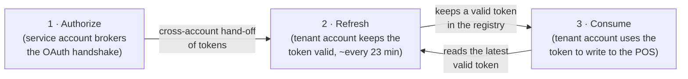

# ConcieraHQ × Lightspeed K-Series — OAuth2 Integration

> **Lightspeed powers the transaction. ConcieraHQ powers the relationship.**

This repository documents how a hospitality venue's **Lightspeed Hospitality K-Series** account is
securely connected to **ConcieraHQ**, and how that connection is kept alive and used over time, so
customer profiles, orders, items and other performance metrics can flow into ConcieraHQ's
customer-intelligence platform.

The integration is built on the **OAuth 2.0 Authorization Code grant** and runs as a **serverless,
multi-tenant architecture on AWS**. A hardened **service account** brokers the OAuth handshake and
holds the client credentials; each venue ("tenant") then has its **own isolated AWS account** that
stores its tokens and runs its own token-refresh and data-sync workflows. This separation keeps the
client secret and the live handshake away from tenant data, and keeps tenants isolated from one
another.

<p align="center">
  
</p>

---

## Table of Contents

- [Overview](#overview)
- [Architecture at a glance](#architecture-at-a-glance)
- [The integration lifecycle](#the-integration-lifecycle)
- [The three workflows](#the-three-workflows)
- [Security model](#security-model)
- [Environments](#environments)
- [Repository structure](#repository-structure)
- [Support](#support)

---

## Overview

Lightspeed delivers the operational foundation hospitality businesses rely on every day. ConcieraHQ
extends that value by transforming transactional data into actionable customer intelligence —
deeper insight into customer behaviours, preferences and purchasing patterns that lets venues
deliver more personalised experiences, strengthen loyalty and unlock new revenue. (See
[`Lightspeed-ConcieraHQ-Value-Proposition.pdf`](./assets/docs/Lightspeed-ConcieraHQ-Value-Proposition.pdf)
for the business case.)

To do that safely, ConcieraHQ never asks a venue for its Lightspeed password. The venue authorises
access from inside their own Lightspeed back office, and ConcieraHQ only ever holds short-lived,
revocable tokens scoped to the permissions the venue approved.

---

## Architecture at a glance

The system is deliberately **one-to-many**: a **single dedicated Lightspeed service account**
brokers authorization for every venue, while each connected venue has its **own dedicated AWS
account**. It also talks to the external **Lightspeed K-Series** authorization server (a
Keycloak-style OpenID Connect provider at `auth.lsk-{stage}.app/realms/k-series`):

| Boundary | Count | Responsibility |
| --- | --- | --- |
| **Lightspeed Service Account** | **One** (shared) | The OAuth **broker**: API endpoints, the initiation/callback Lambdas, the nonce/routing state, and the **only** copy of the client-secret storage. It performs the *authorization* step and nothing else — it never stores tenant tokens or customer data. |
| **Tenant Account** | **Many** (one per venue) | The venue-facing Admin Portal, the venue's own short-lived token storage, and the venue's **own** token-refresh and POS-sync workflows — all in that venue's **own AWS account** for isolation and security. |
| **Lightspeed K-Series (Tenant Back office)** | External | The external authorization & token server where the venue grants access. |

The handshake is brokered centrally so the OAuth **client secret** lives in exactly one hardened
place (the service account). On success the resulting tokens are handed **cross-account** into the
venue's own account, which is then **solely responsible** for refreshing those tokens and using
them to sync data — reading the shared client secret **cross-account** only at the moment it needs
to call Lightspeed. Customer data is processed only inside the originating venue's account and is
never centralised into the service account or shared across tenants. `stage` is either **`demo`**
(trial accounts) or **`prod`** (production).

---

## The integration lifecycle

A venue's connection moves through three stages, each documented in its own workflow file:



1. **Authorize** — the venue clicks **Connect** in the ConcieraHQ Admin Portal; the service account
   brokers the OAuth Authorization Code grant and, on success, hands the access/refresh token pair
   **cross-account** into the venue's own AWS account.
2. **Refresh** — inside the venue's account, a scheduled workflow exchanges the refresh token for a
   fresh token pair ahead of expiry, so the connection stays live with no further venue action.
3. **Consume** — whenever ConcieraHQ needs to write to Lightspeed (e.g. create a customer in the
   POS), a workflow in the venue's account reads the current access token and calls the K-Series
   API. It only ever *reads* the token — refresh stays centralised in stage 2.

---

## The three workflows

| # | Workflow | Where it runs | What it does |
| --- | --- | --- | --- |
| 1 | **[Authorization Code](./AuthorizationCodeWorkflow.md)** | Service account → tenant account | Brokers the OAuth handshake (initiation, callback, code-for-token exchange) and hands tokens off to the tenant account. |
| 2 | **[Access Token Refresh](./TokenRefreshWorkflow.md)** | Tenant account | A Step Functions state machine, triggered ~every 23 minutes, that rotates the stored token pair before expiry and fails safe on persistent errors. |
| 3 | **[Create Customer in POS](./PosAddCustomer.md)** | Tenant account | A Step Functions state machine that reads the current access token and creates a customer record in the K-Series POS — the consumption counterpart to refresh. |

Each workflow doc is self-contained and includes its own sequence/state diagram, data contracts,
resilience behaviour, security notes, and (redacted) resource reference.

---

## Security model

The same principles run through all three workflows:

- **Confidential client** — the authorization code (and every refresh) is exchanged using the
  client secret over HTTP Basic auth; there is no PKCE verifier to intercept.
- **Client-secret isolation** — `client_id` / `client_secret` are stored in **Secrets Manager** in
  the dedicated Lightspeed **service account only** — the single copy anywhere. Tenant accounts
  read it via **cross-account access** at call time and inject it as authorization headers without
  persisting it; it is never exposed to the venue, the browser, or any client-facing surface, and
  never appears in code, logs, or execution payloads.
- **Per-tenant account isolation** — each venue's tokens, refresh machinery, and POS-sync workflows
  live in that venue's **own AWS account**, so one tenant's data and credentials are isolated from
  every other tenant's. Customer data never leaves the originating tenant account for the service
  account or another tenant.
- **Opaque single-use nonce** — during authorization the tenant routing context stays server-side
  and never leaks via the URL, browser history, or referer; consuming the nonce on success gives
  CSRF/replay protection.
- **No secrets in transit URLs** — grant parameters and tokens travel in request bodies and headers,
  never in URLs or query strings.
- **Token rotation** — refresh tokens are single-use and rotated on every cycle (~every 23 min),
  limiting the lifetime of any single token.
- **Fail-safe & generic errors** — persistent failures stop the schedule and flag the integration
  for reconnect rather than hammering Lightspeed; browsers see generic messages while detailed
  diagnostics go only to CloudWatch.

See each workflow doc for the security considerations specific to that stage.

---

## Environments

The Lightspeed authorization/token host is selected at runtime by the `LSK_APP_STAGE` environment
variable (validated as exactly `demo` or `prod`):

| `LSK_APP_STAGE` | Host | Used by |
| --- | --- | --- |
| `demo` | `https://auth.lsk-demo.app/realms/k-series/...` | Trial accounts |
| `prod` | `https://auth.lsk-prod.app/realms/k-series/...` | Production accounts |

The Lightspeed **`client_id` / `client_secret`** are **not** environment variables — they are read
at runtime from **Secrets Manager**, with `LSK_APP_STAGE` selecting the demo vs prod credential set.
Each workflow doc lists the additional environment variables and resources it consumes.

---

## Repository structure

```
.
├── README.md                       # This file — project overview and how the workflows fit together
├── AuthorizationCodeWorkflow.md    # Workflow 1 — OAuth handshake & cross-account token hand-off
├── TokenRefreshWorkflow.md         # Workflow 2 — scheduled access-token refresh
├── PosAddCustomer.md               # Workflow 3 — using the access token to create a POS customer
└── assets
    ├── diagrams
    │   ├── ConcieraHQ-KSeries-Integration-Architecture.png                  # AWS architecture diagram
    │   ├── ConcieraHQ-Admin-Integrations-Lightspeed-Connect.png             # Integrations page (Connect)
    │   ├── ConcieraHQ-Admin-Integration-Lightspeed-Connect-To-K-Series.png  # Authorise Lightspeed screen
    │   └── ConcieraHQ-Admin-Integration-Lightspeed-Connection-Successful.png # Connection confirmation screen
    └── docs
        └── Lightspeed-ConcieraHQ-Value-Proposition.pdf                      # Why Lightspeed + ConcieraHQ
```

---

## Support

ConcieraHQ is developed by **Konnectit.io**. For technical queries relating to this integration,
email **dev@konnectit.io**.
