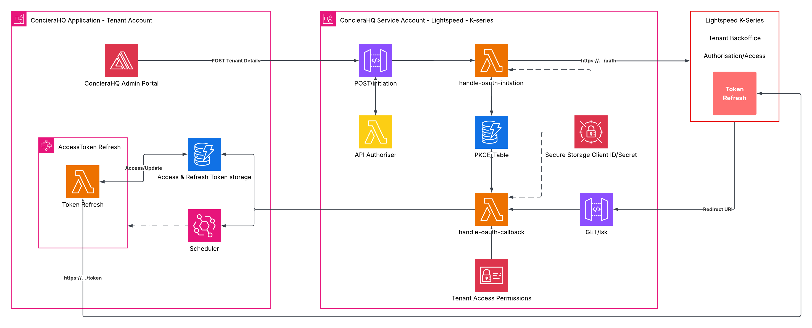
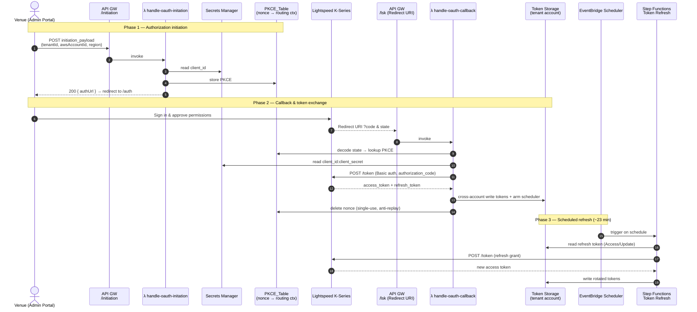
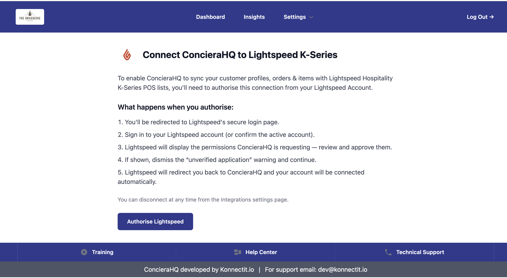

# ConcieraHQ Lightspeed K-Series OAuth2 Workflow Documentation

> **Lightspeed powers the transaction. ConcieraHQ powers the relationship.**

This repository documents the **OAuth 2.0 Authorization Code flow** that connects a hospitality
venue's **Lightspeed Hospitality K-Series** account to **ConcieraHQ**, so that customer profiles,
orders, items and other performance metrics can be securely synced into ConcieraHQ's
customer-intelligence platform.

Lightspeed K-Series is a **confidential client**: the authorization code is exchanged for tokens
using the client secret (HTTP Basic auth), so there is **no PKCE `code_verifier`**. Instead, a
single-use **opaque nonce** is carried in the `state` parameter — it provides CSRF/replay
protection and lets the callback recover its routing context server-side, so tenant identifiers
never travel in the URL.

> ℹ️ **Naming note:** the DynamoDB table is called `PKCE_Table` for historical reasons. It now
> stores **nonce → routing-context** records, not PKCE verifiers.

The integration is implemented as a **serverless, multi-tenant architecture on AWS**, with strict
separation between the tenant-facing application account and the service account that brokers the
OAuth handshake and holds the client credentials.

<p align="center">
  
</p>

---

## Table of Contents

- [Overview](#overview)
- [Architecture at a glance](#architecture-at-a-glance)
- [The OAuth2 flow](#the-oauth2-flow)
  - [Phase 1 — Authorization initiation](#phase-1--authorization-initiation)
  - [Phase 2 — Callback &amp; token exchange](#phase-2--callback--token-exchange)
  - [Phase 3 — Token storage &amp; scheduled refresh](#phase-3--token-storage--scheduled-refresh)
  - [Failure handling](#failure-handling)
- [Sequence diagram](#sequence-diagram)
- [Data contracts](#data-contracts)
- [AWS components](#aws-components)
- [User experience](#user-experience)
- [Security model](#security-model)
- [Repository structure](#repository-structure)
- [Configuration](#configuration)
- [Support](#support)

---

## Overview

Lightspeed delivers the operational foundation hospitality businesses rely on every day. ConcieraHQ
extends that value by transforming transactional data into actionable customer intelligence —
deeper insight into customer behaviours, preferences and purchasing patterns that lets venues
deliver more personalised experiences, strengthen loyalty and unlock new revenue.

To do that safely, ConcieraHQ never asks a venue for its Lightspeed password. The venue authorises
access from inside their own Lightspeed back office, and ConcieraHQ only ever holds short-lived,
revocable tokens scoped to the permissions the venue approved.

---

## Architecture at a glance

The system spans **two isolated AWS accounts** plus the external **Lightspeed K-Series**
authorization server (a Keycloak-style OpenID Connect provider at
`auth.lsk-{stage}.app/realms/k-series`):

| Boundary | Responsibility |
| --- | --- |
| **ConcieraHQ Application — Tenant Account** | The venue-facing Admin Portal, long-term token storage, and the tenant's own token-refresh machinery. |
| **ConcieraHQ Service Account — Lightspeed K-Series** | The OAuth broker: API endpoints, initiation/callback Lambdas, nonce/routing state, and client-secret storage. |
| **Lightspeed K-Series (Tenant Back office)** | The external authorization & token server where the venue grants access. |

The split keeps the OAuth **client secret** and the live handshake inside a hardened service
account, while per-tenant tokens are written **cross-account** into the application account that
actually consumes them. `stage` is either **`demo`** (trial accounts) or **`prod`** (production).

---

## The OAuth2 flow

### Phase 1 — Authorization initiation

1. The venue logs into the **ConcieraHQ Admin Portal**, opens **Settings → Integrations**, and
   clicks **Connect** on the Lightspeed Hospitality K-Series card.
2. The portal sends a `POST` to the service-account endpoint **`{SERVICE-ACCOUNT-URL}/initiation`**
   with the tenant routing context:

   ```json
   {
     "initiation_payload": {
       "tenantId": "string",
       "awsAccountId": "string",
       "region": "string"
     }
   }
   ```

3. The **`handle-oauth-initation`** Lambda (`OAuthInitiator`):
   - fetches the Lightspeed **`client_id`** from **Secrets Manager**;
   - mints a random **`nonce`** (`uuid4`);
   - writes a routing record to the **`PKCE_Table`** keyed `PKCE#{nonce}`, with a **600 s TTL**
     that bounds the flow window;
   - encodes `{ "nonce": ... }` as a **base64url** `state` string (no padding);
   - builds the Lightspeed authorize URL (comma-separated scopes become space-delimited).
4. It returns `200 application/json` with the URL the portal redirects the venue to:

   ```json
   {
     "authUrl": "https://auth.lsk-{stage}.app/realms/k-series/protocol/openid-connect/auth?response_type=code&client_id=...&redirect_uri=...&scope=...&state=..."
   }
   ```

> 🔒 The routing context (`tenantId`, `awsAccountId`, `region`) is **never** placed in the URL —
> only the opaque nonce travels in `state`. The full auth URL is intentionally **not logged**, to
> keep `state` out of CloudWatch.

### Phase 2 — Callback & token exchange

5. The venue signs in to Lightspeed and approves the requested permissions. Lightspeed redirects
   back to the registered **Redirect URI** at **`{SERVICE-ACCOUNT-URL}/lsk`** with `code` and `state`
   query parameters.
6. The **`handle-oauth-callback`** Lambda (`StateManager`) decodes `state`, extracts the nonce, and
   looks up `PKCE#{nonce}` in `PKCE_Table` to recover `tenant_id`, `aws_account_id` and `region`.
   - The record's **TTL is validated explicitly** — DynamoDB TTL deletion is best-effort and can
     lag for hours, so an expired nonce is rejected rather than trusted.
7. The **`Authorisation`** service exchanges the code for tokens against Lightspeed's token
   endpoint, authenticating as a confidential client:
   - `POST https://auth.lsk-{stage}.app/realms/k-series/protocol/openid-connect/token`
   - `Authorization: Basic base64(client_id:client_secret)` (secret pulled from Secrets Manager)
   - body: `grant_type=authorization_code`, `code`, `redirect_uri`
   - bounded by a **3 s connect / 10 s read** timeout so a hung endpoint can't stall the Lambda.
8. On success Lightspeed returns an **access token** and **refresh token**. Over AWS's secure
   internal network and **cross-account access**, these are written directly into the
   **Access &amp; Refresh Token storage** (DynamoDB) in the **tenant account**, and the refresh
   **scheduler is armed**.
9. Only after the token exchange and the cross-account hand-off succeed does the callback
   **consume (delete) the nonce record**, closing the replay window immediately. A failed flow
   leaves the nonce reusable for retry.

### Phase 3 — Token storage & scheduled refresh

10. An **EventBridge Scheduler** in the tenant account triggers the **`AccessToken Refresh`**
    Step Functions workflow on a schedule — refreshing the access token roughly **every 23
    minutes** so the connection stays live with no further action from the venue.
11. The workflow's **Token Refresh** Lambda reads the current refresh token from token storage
    (`Access/Update`), calls Lightspeed's `/token` endpoint with the refresh grant, and writes the
    rotated tokens back. The **tenant app runs its own token-refresh process** on top of this.

### Failure handling

If any step of the workflow fails, the **tenant is notified**. User-facing errors stay generic
(e.g. *"Invalid state parameter"*, *"An unexpected error occurred"*) while specific diagnostics
(missing fields, misconfigured environment variables, upstream failures) are sent to **CloudWatch
only** via the error `detail`, so internal schema is never leaked to the browser.

---

## Sequence diagram



---

## Data contracts

**Initiation request** → `POST /initiation`

```json
{ "initiation_payload": { "tenantId": "string", "awsAccountId": "string", "region": "string" } }
```

**Initiation response** → `200 application/json`

```json
{ "authUrl": "https://auth.lsk-{stage}.app/realms/k-series/protocol/openid-connect/auth?response_type=code&client_id=...&redirect_uri=...&scope=...&state=..." }
```

**`state` parameter** — base64url-encoded JSON, no padding

```json
{ "nonce": "uuid4" }
```

**`PKCE_Table` record** (nonce → routing context)

```text
pk             = "PKCE#{nonce}"     # nonce is a uuid4
tenant_id      = "..."              # routing context (snake_case)
aws_account_id = "..."
region         = "..."
ttl            = now + 600s         # bounds the flow window
```

**Token response** from Lightspeed `/token` → `200 OK`

```json
{
  "access_token": "eyJ...",
  "refresh_token": "eyJ...",
  "token_type": "Bearer",
  "expires_in": 3600,
  "scope": "..."
}
```

---

## AWS components

| Component | AWS service | Account | Role in the flow |
| --- | --- | --- | --- |
| ConcieraHQ Admin Portal | Amplify | Tenant | Venue-facing UI that starts the connection |
| `{SERVICE-ACCOUNT-URL}/initiation` | API Gateway | Service | Entry point for the authorization request |
| API Authoriser | Lambda | Service | Authorises inbound initiation requests |
| `handle-oauth-initation` | Lambda | Service | Mints nonce, stores routing ctx, builds auth URL |
| `PKCE_Table` | DynamoDB | Service | Nonce → routing-context store (name is historical) |
| Secure Storage Client ID/Secret | Secrets Manager | Service | Holds the OAuth client credentials |
| `{SERVICE-ACCOUNT-URL}/lsk` | API Gateway | Service | OAuth **Redirect URI** callback endpoint |
| `handle-oauth-callback` | Lambda | Service | Validates state, exchanges code for tokens |
| Tenant Access Permissions | IAM | Service | Cross-account access into the tenant token store |
| Access &amp; Refresh Token storage | DynamoDB | Tenant | Persists per-tenant access/refresh tokens |
| Scheduler | EventBridge | Tenant | Triggers periodic refresh (~23 min) |
| AccessToken Refresh | Step Functions | Tenant | Orchestrates the refresh workflow |
| Token Refresh | Lambda | Tenant | Rotates tokens against Lightspeed |

---

## User experience

The whole handshake is two clicks for the venue.

**1. Integrations page** — the venue opens **Settings → Integrations** and clicks **Connect** on the
Lightspeed Hospitality K-Series card.

<p align="center">
  
</p>

**2. Connect screen** — ConcieraHQ explains what will happen, then **Authorise Lightspeed** kicks off
Phase 1. The venue is redirected to Lightspeed's secure login, approves the requested permissions,
and is redirected straight back — connected automatically.

<p align="center">
  
</p>

A venue can disconnect at any time from the Integrations settings page.

---

## Security model

- **Confidential client** — the code is exchanged using the client secret over HTTP Basic auth;
  there is no PKCE verifier to intercept.
- **Opaque single-use nonce** — the routing context stays server-side and never leaks via the URL,
  browser history or referer; consuming the nonce on success gives CSRF/replay protection.
- **Client secret isolation** — `client_id`/`client_secret` live only in **Secrets Manager** in the
  hardened service account, never in code or in the tenant account.
- **Account separation** — the live OAuth handshake (service account) is isolated from long-term
  token storage and consumption (tenant account); tokens move via secure cross-account access.
- **Bounded flow window** — nonce records carry a 600 s TTL, validated explicitly on callback
  because DynamoDB TTL deletion is best-effort and can lag.
- **No state in logs** — the full auth URL is never logged, keeping `state` out of CloudWatch.
- **Generic user errors** — browsers see generic messages; specific diagnostics go to CloudWatch
  via the error `detail` only.
- **Bounded upstream calls** — token exchange uses a 3 s connect / 10 s read timeout so a hung
  Lightspeed endpoint can't stall the Lambda.
- **Token rotation** — access tokens are refreshed on a schedule (~23 min), limiting the lifetime
  of any single token.

---

## Repository structure

```
.
├── README.md
├── assets
│   ├── diagrams
│   │   ├── architecture.png            # AWS architecture diagram
│   │   └── oauth2-workflow.lucid.json  # Lucidchart source for the diagram
│   └── screenshots
│       ├── 01-integrations.png         # Integrations page (Connect)
│       └── 02-connect.png              # Authorise Lightspeed screen
└── docs
    └── Lightspeed-ConcieraHQ-Value-Proposition.pdf           # Why Lightspeed + ConcieraHQ
```

---

## Configuration

Environment variables consumed by the service-account Lambdas:

| Key | Description |
| --- | --- |
| `PKCE_TABLE` | DynamoDB table storing nonce → routing-context records |
| `REDIRECT_URI` | OAuth redirect URI registered with Lightspeed (`https://auth.concierahq.io/lsk`) |
| `LSK_SCOPES` | Comma-separated OAuth scopes, e.g. `financial-api,orders-api,items,offline-access` |
| `LSK_APP_STAGE` | Lightspeed environment slug — `demo` or `prod` — embedded in the auth/token host |

Derived endpoints (`auth.lsk-{LSK_APP_STAGE}.app/realms/k-series/protocol/openid-connect/{auth,token}`):

| `LSK_APP_STAGE` | Host |
| --- | --- |
| `demo` | `https://auth.lsk-demo.app/...` (trial accounts) |
| `prod` | `https://auth.lsk-prod.app/...` (production accounts) |

The Lightspeed **`client_id` / `client_secret`** are **not** environment variables — they are read
at runtime from **Secrets Manager**, with `LSK_APP_STAGE` selecting the demo vs prod credential set.

---

## Support

ConcieraHQ is developed by **Konnectit.io**.
For support, email **dev@konnectit.io**.
