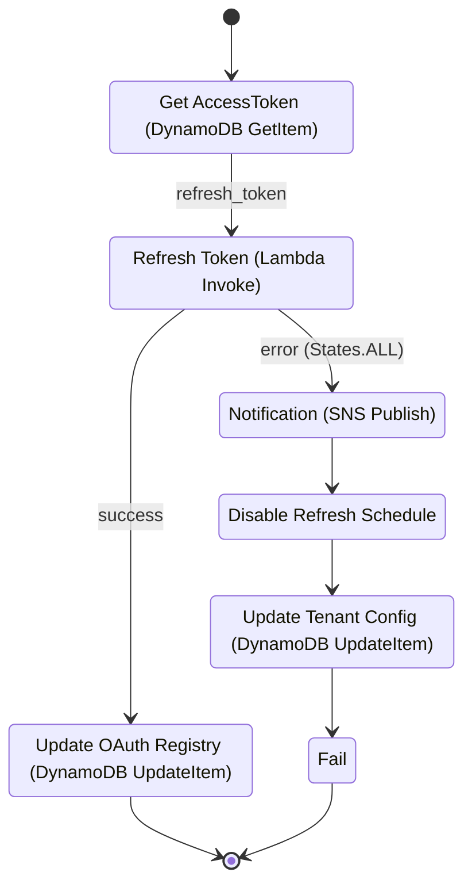

# ConcieraHQ Lightspeed K-Series — OAuth2 Access Token Refresh Workflow

This document describes the automated workflow ConcieraHQ uses to maintain valid OAuth2
credentials for the **Lightspeed K-Series** integration. It is provided to support the
application review process for production OAuth2 credentials and is intended to demonstrate
how access and refresh tokens are stored, rotated, and protected throughout their lifecycle.

> Region identifiers, AWS account identifiers, and individual tenant identifiers have been
> redacted from this document. Resource ARNs are shown with placeholders (`<aws-region>`,
> `<aws-account-id>`, `<tenantId>`) where required for context.

---

## Overview

After a venue completes the initial Authorization Code grant and ConcieraHQ receives its
first access/refresh token pair from Lightspeed, those credentials must be kept current for
the integration to continue syncing data. Lightspeed access tokens are short-lived, so
ConcieraHQ runs a scheduled, fully automated refresh process that exchanges the stored
refresh token for a new token pair **ahead of expiry** — without any user interaction.

The refresh process is implemented as an **AWS Step Functions** state machine, triggered on
a fixed schedule by **Amazon EventBridge Scheduler**. The workflow is self-healing on
transient errors and fails safe on persistent ones, alerting operators and cleanly
disabling itself rather than repeatedly hammering the Lightspeed authorization server.

---

## Trigger and cadence

| Property | Value |
|---|---|
| Trigger | Amazon EventBridge Scheduler |
| Schedule name | `LSK-Refresh-OauthToken` |
| Cadence | `rate(23 minutes)` |
| Target | Step Functions state machine `chq-prod-sf-global-refresh-lsk-oauthToken` |

The 23-minute cadence is set to refresh proactively, comfortably within the access token's
validity window, so a fresh token is always in place before the previous one expires. This
avoids any gap in service and removes the need for "refresh-on-401" retry logic in the
downstream sync paths.

---

## Workflow



### Happy path

**1. Get AccessToken** — `DynamoDB:GetItem`
The current refresh token is read from the application OAuth registry table
(`chq-prod-ddb-global-store-application-oauth-registory`) using the application key
`AppID = lskpos`. A result selector extracts only the `RefreshToken` value and passes it
forward; no other stored fields enter the execution payload.

**2. Refresh Token** — `Lambda:Invoke`
The `chq-prod-lambda-global-refresh-lsk-oauthToken` function presents the refresh token to
the Lightspeed K-Series authorization server and receives a new token set. The function
returns the new `access_token`, the rotated `refresh_token`, a `last_refreshed_at`
timestamp, and an `expires_at` timestamp. The token exchange itself — request shape,
credential handling, retries, and validation — is detailed in
[Token exchange](#token-exchange-refresh-function-internals) below.

**3. Update OAuth Registry** — `DynamoDB:UpdateItem`
The new values are written back to the same registry record:

```
SET AccessToken   = :access_token,
    RefreshToken  = :refresh_token,
    LastRefreshAt = :last_refreshed_at,
    ExpiresAt     = :expires_at
```

Because both the access token **and** the refresh token are overwritten on every cycle, the
integration honours **refresh token rotation** — each refresh token is single-use and is
replaced by a freshly issued one. The execution then ends successfully.

### Failure path

If the refresh Lambda fails after exhausting its retries (see *Resilience* below), a
catch-all transition (`States.ALL`) routes the execution into a controlled shutdown:

**4. Notification** — `SNS:Publish`
A failure message is published to the `ConcieraHQ-Notifications` topic so operators are
alerted immediately. Tenants are notified through the admin portal, which surfaces a "reconnect required" state when the integration is marked as unauthorised (see next step).

**5. Disable Refresh Schedule** — `Scheduler:UpdateSchedule`
The `LSK-Refresh-OauthToken` EventBridge schedule is set to `DISABLED`. This prevents the
workflow from repeatedly retrying against the Lightspeed authorization server once the
refresh token can no longer be exchanged (for example, after revocation or a persistent
upstream error).

**6. Update Tenant Config** — `DynamoDB:UpdateItem`
The tenant configuration registry is updated to mark the Lightspeed integration as
unauthorised:

```
SET integrations.lightspeedK.authorised = false
```

A condition expression (`attribute_exists(integrations.lightspeedK)`) ensures the update
only applies where the integration is actually configured. This flag is what the admin
portal reads to surface a "reconnect required" state to the venue.

**7. Fail** — terminal `Fail` state, marking the execution as failed for observability.

---

## Token exchange (refresh function internals)

The `chq-prod-lambda-global-refresh-lsk-oauthToken` function performs the actual OAuth2
refresh-token grant against the Lightspeed K-Series authorization server.

### Endpoint and environment selection

The token host is resolved at runtime from the `LSK_APP_STAGE` environment variable, which
must be exactly `prod` or `demo` (the value is validated; any other value raises an error
before a request is made):

| `LSK_APP_STAGE` | Authorization host |
|---|---|
| `prod` | `https://auth.lsk-prod.app` |
| `demo` | `https://auth.lsk-demo.app` |

The request is issued to the K-Series realm token endpoint:

```
POST https://auth.lsk-{LSK_APP_STAGE}.app/realms/k-series/protocol/openid-connect/token
Content-Type: application/x-www-form-urlencoded

grant_type=refresh_token&refresh_token={refresh_token}
```

The grant parameters are sent in the form-urlencoded request **body**, never in the URL or
query string, so no token material is exposed in request lines, proxy logs, or browser
history.

### Credential handling

The function authenticates as a **confidential client**. The `client_id` / `client_secret`
are held in **AWS Secrets Manager** within the ConcieraHQ service account and are injected
into the request as cached authorization headers at call time. These credentials are **never
stored in, or accessible from, any tenant account** — the venue never sees or holds the
application's client secret. Header construction is isolated in a dedicated `Headers`
component so the secret is read once and reused, rather than embedded in application logic.

### Retry and backoff

The function applies its own retry layer on top of the Step Functions retry on the Lambda
invoke, giving two independent layers of resilience:

- **Max retries:** 3 attempts
- **Backoff:** linear — 2s, 4s, 6s between attempts
- **Retried conditions:** HTTP `429` (rate limited), HTTP `5xx` (transient server errors),
  and network errors (connect/read timeouts and connection failures)
- **Non-retryable:** any other HTTP `4xx` raises immediately, so an invalid or revoked
  refresh token fails fast instead of being retried — which is what ultimately drives the
  state machine's controlled-shutdown path
- After retries are exhausted, the last error is surfaced in the raised exception message

### Timeouts

A shared connection pool enforces a **3-second connect** and **10-second read** timeout, so a
stalled or unresponsive endpoint cannot hold the Lambda open for its full execution limit.

### Response validation and safety margin

Before returning, the function validates the response and normalises it for the state machine:

- The response must be a JSON object and must contain both `access_token` and
  `refresh_token`; a malformed `200` (e.g. a proxy error page or truncated body) is rejected
  rather than persisted, preventing empty tokens from being written and only failing on the
  next cycle.
- `expires_at` is computed as `now + expires_in − 60s`. The 60-second buffer ensures the
  stored expiry is always slightly conservative, so the token is treated as expired a little
  before Lightspeed actually expires it.
- `last_refreshed_at` is recorded as a UTC timestamp.

The normalised output returned to the state machine is:

```json
{
  "access_token":     "<new access token>",
  "refresh_token":    "<rotated refresh token>",
  "expires_at":       "<unix epoch seconds, minus 60s buffer>",
  "last_refreshed_at": "<UTC ISO-8601 timestamp>"
}
```

### Error logging

Failed token responses are summarised through a safe-error helper that extracts **only** the
standard OAuth `error` and `error_description` fields. Raw response bodies — which can contain
token material — are never logged, keeping CloudWatch diagnostics free of credentials.

---

## Token storage

| Item | Location |
|---|---|
| Access token, refresh token, expiry, last-refresh timestamp | DynamoDB OAuth registry (`AppID = lskpos`) |
| Integration authorisation status (per tenant) | DynamoDB tenant config registry (`tenantId = <tenantId>`) |
| Client ID / client secret | AWS Secrets Manager (not handled by this workflow) |

Tokens are never returned to, or rendered in, any end-user-facing surface. They exist only
within the ConcieraHQ service account's data stores and are read solely by server-side
components.

---

## Resilience and error handling

- **Two-layer retry** — resilience is applied at two independent levels. The Step Functions
  invoke step retries on Lambda service exceptions (`Lambda.ServiceException`,
  `Lambda.AWSLambdaException`, `Lambda.SdkClientException`, `Lambda.TooManyRequestsException`)
  with `MaxAttempts: 3`, `IntervalSeconds: 1`, `BackoffRate: 2`, and `FULL` jitter. Inside the
  function, the HTTP client independently retries the Lightspeed call (3 attempts; 2s/4s/6s
  backoff) on `429`, `5xx`, and network errors, while failing fast on other `4xx` responses.
  Transient infrastructure issues recover automatically without operator involvement.
- **Bounded request time** — a 3s connect / 10s read timeout on the token call prevents a
  stalled endpoint from consuming the Lambda's full execution window.
- **Fail-safe shutdown** — any non-recoverable error stops the schedule rather than looping,
  protecting the Lightspeed authorization server from repeated invalid refresh attempts.
- **Operator alerting** — failures are published to SNS the moment they occur.
- **Graceful UX degradation** — the tenant's integration is flagged as unauthorised so the
  venue is prompted to reconnect, instead of silently failing.

---

## Security considerations relevant to verification

- **Confidential client** — the integration authenticates to Lightspeed as a confidential
  client. The `client_id` / `client_secret` are held in AWS Secrets Manager **within the
  ConcieraHQ service account**, injected as cached authorization headers at request time, and
  are never stored in or accessible from any tenant account, code, logs, or execution
  payloads.
- **No secrets in transit URLs** — grant parameters are sent in a form-urlencoded request
  body, never in URLs or query strings.
- **Refresh token rotation** — refresh tokens are single-use and replaced on every cycle.
- **Least-data execution** — only the values strictly required at each step are carried in
  the state machine payload (e.g. the registry read returns the refresh token alone).
- **Server-side only** — the entire refresh lifecycle runs inside the ConcieraHQ service
  account; no token material crosses into tenant-facing or browser contexts.
- **Diagnostics isolation** — detailed execution diagnostics are routed to CloudWatch;
  user-facing surfaces show only generic status.
- **Encryption at rest** — token material is stored in DynamoDB and benefits from encryption
  at rest.

---

## Resource reference (redacted)

| Logical resource | Type | Identifier |
|---|---|---|
| State machine | Step Functions | `chq-prod-sf-global-refresh-lsk-oauthToken` |
| Refresh function | Lambda | `arn:aws:lambda:<aws-region>:<aws-account-id>:function:chq-prod-lambda-global-refresh-lsk-oauthToken` |
| OAuth registry | DynamoDB | `chq-prod-ddb-global-store-application-oauth-registory` |
| Tenant config registry | DynamoDB | `chq-prod-ddb-<tenantId>-record-tenant-config-registry` |
| Notifications topic | SNS | `arn:aws:sns:<aws-region>:<aws-account-id>:ConcieraHQ-Notifications` |
| Refresh schedule | EventBridge Scheduler | `LSK-Refresh-OauthToken` |

---

*ConcieraHQ is developed by Konnectit.io. For technical queries relating to this integration,
contact dev@konnectit.io.*
